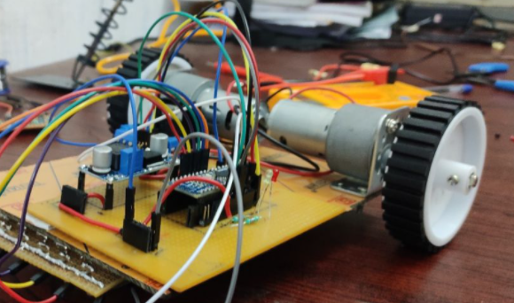
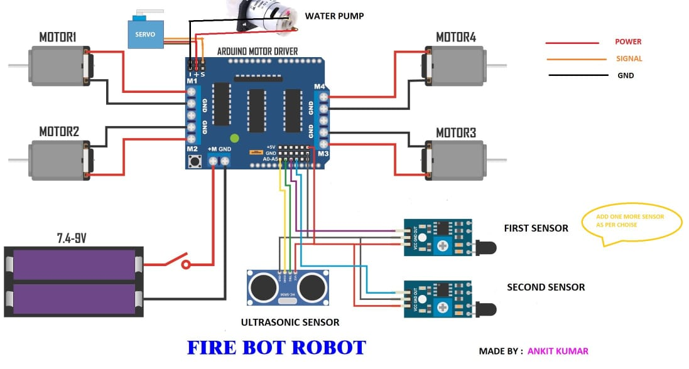
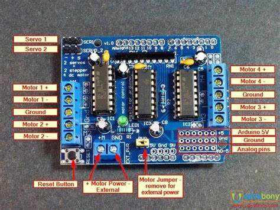

# FIRE_FIGHTING_AUTOMATED_ROBOT
This is the official repository of the Fire Fighting Robot under Chimi Changa (Robotics Club).

## Circuit Visualization and Simulation Snippets

## Description

## Motive

## Project Structure

### Link to [Visualization](https://www.tinkercad.com/things/3WVauQzXvoe-fire-bot-test-circuit-visualization) [&](https://www.tinkercad.com/things/3WVauQzXvoe) on [Tinkercad](https://www.tinkercad.com/dashboard?type=circuits&collection=designs).
